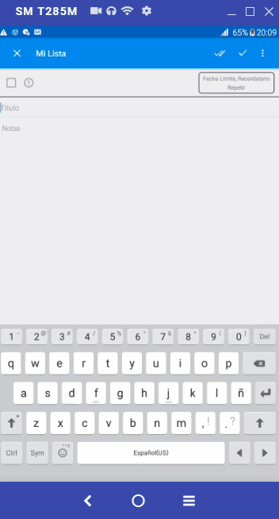

# Automation Mobile Testing for WHEN.DO app
This is a small example to set up an automation test environment with Java, Gradle, JUnit,  and Appium.
More details [here!](https://gonzalohk.xyz/blog/configuracion-de-un-entorno-de-testing-funcional-automatizado-mobile-p1)

### When.do App
- Download [here!](https://drive.google.com/file/d/1qvl-pTmCmMaTPty-DClIkGec2ItE8KNP/view?usp=sharing)

### Tests
- Add Note
- Add Notes
- Remove Note

### Setup
- Local - In Conf.java update SELECTED_DRIVER with "android" and start the APPIUM Server.
- Remote - In Conf.java update SELECTED_DRIVER with "browserstack" and in BrowserStack.java update your username and accessKey.

### Run
```sh
gradle clean test
```

<p align="center">
  
</p>

